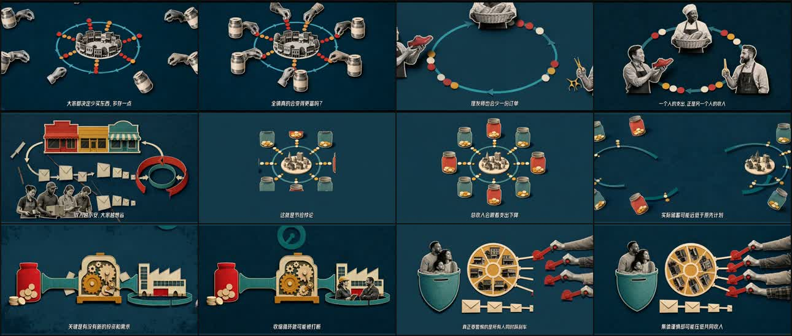

# Chat Animation

[](LICENSE)
[](https://www.python.org/)
[](https://ffmpeg.org/)
[](https://agentskills.io/specification)
[](skills/chat-animation/scripts/self_test.py)
[](#why-chat-animation)

[](https://developers.openai.com/codex/skills)
[](https://code.claude.com/docs/en/skills)
[](https://www.workbuddy.ai/docs/workbuddy/From-Beginner-to-Expert-Guide/Practice-Cases/Create-Skills)
[](https://github.com/NousResearch/hermes-agent/blob/main/website/docs/user-guide/features/skills.md)
[](https://cursor.com/)
[](https://geminicli.com/)
[](https://opencode.ai/)

**English** · [简体中文](README.md)

Turn one idea, article, question, or reference into a complete narrated explainer animation—not merely a set of prompts.



https://github.com/user-attachments/assets/b02f0520-e2f9-4368-8504-84276eff1d2f

## Install in 30 seconds

The recommended route uses the open `skills` CLI. It discovers this repository's standard `skills/<name>/SKILL.md` layout and lets you choose the target agent:

```bash
npx skills add xue-xiaobao/chat-animation --skill chat-animation -g
```

Install only for Codex:

```bash
npx skills add xue-xiaobao/chat-animation --skill chat-animation -g -a codex -y
```

Restart the agent or open a new session after installation, then describe the animation you want. If Node.js is unavailable, use the manual copy instructions below.

### Ask your agent to install it

If you do not want to use a terminal, copy the complete prompt below into Codex, Claude Code, WorkBuddy, Hermes, or another Skill-aware agent:

```text
Install the chat-animation Skill from https://github.com/xue-xiaobao/chat-animation.

Requirements:
1. Read README.md and skills/chat-animation/SKILL.md before installing.
2. Install skills/chat-animation into your current agent's user-level Skill directory without modifying the Skill itself.
3. Check that Python 3.9+, FFmpeg, and FFprobe are available.
4. Never write real API keys into chat, logs, or the repository.
5. After installation, run preflight only. Do not submit paid image, video, or speech generation jobs.
6. Report the install path, check results, and which API keys I still need to configure.
```

## Supported agents

Chat Animation follows the standard `SKILL.md` directory layout. Its core workflow only requires an agent that can read files, run Python, and use a terminal.

| Agent | Status | Recommended installation |
| --- | --- | --- |
| Codex App / CLI | **End-to-end verified** | `skills` CLI: `-a codex` |
| Claude Code | Format compatible | `skills` CLI: `-a claude-code` |
| Tencent WorkBuddy | Format compatible | Import the Skill or copy it to `~/.workbuddy/skills/chat-animation/` |
| Hermes Agent | Format compatible | `skills` CLI: `-a hermes-agent`, or copy it to `~/.hermes/skills/` |
| Cursor | Format compatible | `skills` CLI: `-a cursor` |
| Gemini CLI | Format compatible | `skills` CLI: `-a gemini-cli` |
| OpenCode | Format compatible | `skills` CLI: `-a opencode` |

“Format compatible” means the directory layout and runtime requirements match that agent's Skill mechanism. This release's real end-to-end production regression was completed on Codex. Tool names, permissions, and credential setup can vary across agents.

## Animation styles

Two production-tested 16:9 styles are built in. They are not mere image filters: each style changes the visual-metaphor rules, keyframe count, motion strategy, and QA criteria.

| Style | Visual language | Keyframe and motion strategy | Best suited to |
| --- | --- | --- | --- |
| **Vox style** (`vox`, default) | Bold flat color fields, black-and-white halftone cut-outs, selective colored cardstock, cream keylines, and editorial-poster composition | Generates distinct but compositionally anchored first and last frames; paper groups assemble in causal order, then settle into one very slow breathing pulse | Financial mechanisms, cognitive biases, abstract concepts, and argument-led explainers |
| **Storybook style** (`storybook`) | Warm layered cut-paper dioramas, sticker-like characters, soft shadows, and concrete everyday scenes | Generates one authoritative hero frame and reuses it as both keyframes; foreground pieces enter gently over about 1.2 seconds, then breathe subtly on an approximately four-second cycle | Children's education, fables, psychology, social concepts, and friendlier everyday explanations |

Style selection follows “explicit user choice → closest reference material → default Vox.” The selected definition is snapshotted when a project is initialized, so later Skill updates cannot silently change an existing project. Ask for “Vox style” or “Storybook style” in the production request.

## How it works

Chat Animation does not generate an entire video in one opaque request. It divides production into five layers. Every layer has structured artifacts, automated checks, and an approval record; downstream work starts only after its upstream contract is accepted. The three expensive layers—visual, motion, and voice—produce one sample before batch generation by default.

| Layer | Responsibility | Default model or tool | Human responsibility |
| --- | --- | --- | --- |
| 1. Direction | Research the topic; define the thesis, narrative, scene narration, visual metaphors, and transition plan | The current agent's language model, with authoritative research for professional or time-sensitive claims | Confirm that the narration works without visuals, facts are accurate, and scenes deserve production |
| 2. Visual | Generate meaningful static keyframes that lock style, composition, and subject relationships | `agnes-image-2.1-flash` | Review one keyframe sample, then inspect style, composition, anatomy, and unwanted text across the batch |
| 3. Motion | Generate scene motion and transitions from a first frame, end frame, and English motion prompt | `agnes-video-v2.0`, 1280×720, 24 fps, keyframes mode | Review one full motion sample for reference fidelity, deformation, motion amplitude, and transition rhythm |
| 4. Voice | Generate per-scene narration with a preset or authorized cloned voice | `mimo-v2.5-tts` or `mimo-v2.5-tts-voiceclone` | Choose the voice source and approve a sample for timbre, pace, emotion, and pauses |
| 5. Composition | Retimes visuals to narration, joins scenes and transitions, renders captions, and exports the MP4 | Local FFmpeg / FFprobe; no generative model | Review the final story, synchronization, captions, transitions, and overall viewing experience |

Core operating principles:

1. **Direct before generating:** make the argument and narration clear before spending image, video, or voice credits.
2. **Keyframes constrain motion:** animate from approved visual states instead of asking text-to-video to guess the composition.
3. **Plan transitions early:** choose hard cuts, dedicated transitions, or fused transitions; one-second dedicated transitions are the default.
4. **Narration is the master clock:** preserve natural speech and retime silent visuals instead of accelerating the voice.
5. **Keep humans in the loop:** the agent self-checks every layer and waits for approval by default; explicit full-auto mode is also available.
6. **Resume and revise locally:** preserve prompts, task IDs, hashes, approvals, and intermediate media so interrupted jobs can resume and one scene can be replaced independently.

## What it does

Chat Animation gives a compatible AI agent a self-contained, five-stage production workflow:

```text
Direction → Visual keyframes → Motion & transitions → Voice → Final composition
```

Give it a request such as:

> Use Chat Animation to create a fun, 60-second explainer about the paradox of thrift for adults with no economics background. Let me review each stage.

The workflow plans the argument, writes narration and storyboards, generates images and motion, creates speech, aligns the picture to the voice, renders captions, and exports a verified MP4.

## Why Chat Animation?

- **Idea to MP4:** produces a complete video instead of stopping at scripts or prompts.
- **Review before spending:** creates one visual, motion, and voice sample before costly batches.
- **Audio-master timing:** keeps narration natural and retimes silent video to match it.
- **Controllable motion:** Agnes receives a first frame, an end frame, and an English motion prompt.
- **Three edit modes:** hard cuts, dedicated transitions, or fused transitions; dedicated one-second transitions are the default.
- **Local, resumable projects:** saves manifests, provider task IDs, hashes, reviews, and downloaded outputs.
- **Targeted revisions:** redo one scene, transition, voice, or caption layer without rebuilding everything.
- **Built-in Vox style:** paper collage, stickers, halftones, readable metaphors, and restrained breathing motion.
- **Preset or cloned voice:** use a MiMo preset voice or an authorized MP3/WAV voice reference.
- **Portable captions:** downloads and verifies Smiley Sans once, then falls back to built-in macOS or Windows CJK fonts.

## Requirements

- Codex or another agent capable of loading and following `SKILL.md`
- Python 3.9+
- FFmpeg and FFprobe
- An Agnes API key for image and video generation
- A Xiaomi MiMo API key for narration

Agnes and MiMo are external services and may charge for usage. Never commit API keys, generated voice references, or private project outputs.

## Manual install and configuration

Without the `skills` CLI, clone the repository and copy `skills/chat-animation` into your agent's user Skill directory.

macOS/Linux example:

```bash
mkdir -p ~/.codex/skills
cp -R skills/chat-animation ~/.codex/skills/chat-animation
```

Windows PowerShell example:

```powershell
New-Item -ItemType Directory -Force "$env:USERPROFILE\.codex\skills" | Out-Null
Copy-Item -Recurse -Force "skills\chat-animation" "$env:USERPROFILE\.codex\skills\chat-animation"
```

Configure credentials in your environment or operating-system secret store:

```bash
export AGNES_API_KEY="<your-key>"
export MIMO_API_KEY="<your-key>"
```

Run the preflight before the first project:

```bash
python3 skills/chat-animation/scripts/project.py preflight
```

## Use

In Codex, ask naturally:

> Use `$chat-animation` to create a Vox-style explainer about the disposition effect. Use human review gates.

The default reviewable flow is:

1. Review the thesis, narration, storyboard, visual metaphors, and transition plan.
2. Review one generated visual sample before the remaining images.
3. Review one motion sample before the remaining video jobs.
4. Choose a preset or authorized cloned voice and review one audio sample.
5. Review the final synchronized, captioned MP4.

To remove all waiting gates, explicitly say:

> Complete the animation fully automatically and skip all human approvals.

Self-checks, deterministic validation, artifacts, and failure stops still run in full-auto mode.

## Output

Each project keeps editable and auditable layers:

```text
project_01/
├── request.json
├── script.json
├── state/
├── visual/
├── motion/
├── audio/
├── composition/
│   └── final.mp4
└── reviews/
```

The default final format is 1280×720, 24 fps, H.264 video with AAC narration. See the complete workflow in [`SKILL.md`](skills/chat-animation/SKILL.md).

## FAQ

### Does it cost money?

The Skill itself is free to install and is released under the MIT License. Production may involve three external costs: your agent or language model, Agnes image/video generation, and Xiaomi MiMo speech generation. Python, FFmpeg, and local composition are free. Refer to each provider's console for current prices and balances.

### How many tokens does it use?

There is no fixed number. Direction, research, revisions, and agent conversations consume language-model tokens. Agnes image/video jobs and MiMo speech use their own task, duration, or credit billing rather than the agent's text-token meter. Cost is driven mainly by scene count, animation duration, and retries. The default sample-before-batch gates are designed to prevent avoidable usage.

### How do I install it?

The recommended command is:

```bash
npx skills add xue-xiaobao/chat-animation --skill chat-animation -g
```

You can also paste the “Ask your agent to install it” prompt above into your agent, or manually copy `skills/chat-animation` into its user-level Skill directory. Run `preflight` afterward and configure the Agnes and MiMo API keys it requests.

### How do I use it?

Restart your agent after installation, then describe the subject, audience, duration, and style. For example:

> Use `$chat-animation` to make a one-minute Vox-style explainer about the paradox of thrift for adults with no economics background. Let me review every stage.

By default, you review direction, a visual sample, a motion sample, a voice sample, and the final video. Waiting gates are skipped only when you explicitly request full-auto production with all human approvals skipped.

## License

The repository is available under the [MIT License](LICENSE). The editorial halftone paper-collage method in the Vox style was adapted and extended from the MIT-licensed [`pyang5166/gbro-collage-broll`](https://github.com/pyang5166/gbro-collage-broll); see [Third-Party Notices](skills/chat-animation/THIRD_PARTY_NOTICES.md) for the original copyright and license. “Vox style” describes a category of editorial visual language and does not imply affiliation with, endorsement by, or sponsorship from Vox Media.

Smiley Sans is not bundled; it is downloaded from its official release at initialization and remains under the SIL Open Font License 1.1. External models and services retain their own terms.
